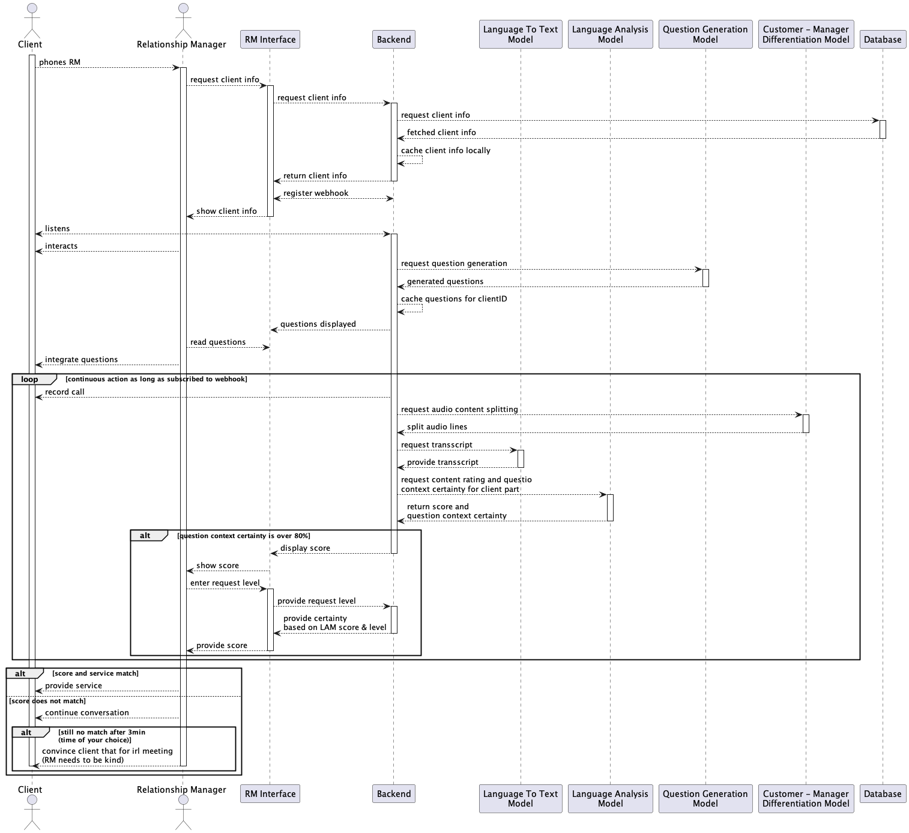

<p align="center">
  
</p>
<p align="center">
    <h1 align="center">FAKESNIFFER</h1>
</p>
<p align="center">
    <em>Empowering Secure Code, encapsulating FakeSniffer's purpose of detecting potential threats and providing value proposition while emphasizing its importance in the software industry.</em>
</p>
<p align="center">
	
	
	
	
<p>
<p align="center">
	<!-- default option, no dependency badges. -->
</p>

<br><!-- TABLE OF CONTENTS -->
<details>
  <summary>Table of Contents</summary><br>

- [ Overview](#overview)
- [ Features](#features)
- [ Repository Structure](#repository-structure)
- [ Modules](#modules)
- [ Getting Started](#getting-started)
  - [ Installation](#installation)
  - [ Usage](#usage)
  - [ Tests](#tests)
- [ Contributing](#contributing)
- [ Roadmap](#project-roadmap)
- [ License](#license)
</details>
<hr>

##  Overview

FakeSniffer is an open-source software application developed primarily for detecting potential threats in software applications, facilitating secure software development practices. Leveraging a unified Spring Boot platform, it offers integrated Web, REST APIs, Websocket, and JPA (Java Persistence API) functionality. Key functionalities include client data management through Spring Data JPA repositories, report retrieval based on client ID and date ranges, real-time WebSocket connectivity for messaging between clients and the server, and machine learning model integration for content generation and filtering decisions. With robust test coverage using the SpringBoot testing environment, FakeSniffer promises enhanced security and reliability in software development projects.

---

##  Features

|   |    Feature          | Description                                                                |
|---|----------------------|----------------------------------------------------------------------------|
|⚙️  | **Architecture**    | A Java project based on Spring Boot v3.3.1, with multi-module development setup, integrating Web, REST APIs, Websockets, JPA (Java Persistence API), and leveraging PostgreSQL as the database. Uses Lombok for simplified coding style. |
|🔩 | **Code Quality**    | Clean and well-structured code using Spring conventions. Leverages proper indentation, comments, and modularization best practices. |
|📄 | **Documentation**   | Good quality documentation provided for major components through Javadoc comments. Some sections could benefit from expanded explanations for easier onboarding and understanding by new contributors. |
|🔌 | **Integrations**    | Uses various libraries like Spring Data JPA, RestTemplate, WebSocket, LTTM (Long Term Transcript Model), LamModel (LAM model), QuestionGeneration service, and external APIs for transcription. |
|🧩 | **Modularity**      | The project is broken down into different services, controllers, configurations, models, and utility classes, promoting reusability and modifying individual components with minimal impact on others. |
|🕰️ | **Performance**    | Real-time messaging via WebSocket provides efficient communication between clients and the server. Periodic analysis of client conversations through LAM model and LTTM is performed every second. |
|🌍️  | **Scalability**    | With an event-driven architecture (WebSocket) and modularized design, FakeSniffer could scale horizontally by adding more servers for handling a larger number of clients and conversations. |

---

##  Repository Structure

```sh
└── FakeSniffer/
    ├── build.gradle
    ├── gradle
    │   └── wrapper
    ├── gradlew
    ├── gradlew.bat
    ├── settings.gradle
    └── src
        ├── main
        └── test
```

---

##  Modules

<details closed><summary>.</summary>

| File                                                                                   | Summary                                                                                                                                                                                                                                                                                                                                                |
| ---                                                                                    | ---                                                                                                                                                                                                                                                                                                                                                    |
| [build.gradle](https://github.com/Bissbert/FakeSniffer/blob/master/build.gradle)       | Build configuration for FakeSniffer Java project, adhering to version 3.3.1 of Spring Boot and its dependencies. Leverages Lombok for simplified coding style and PostgreSQL as the database. Conveniently initializes Web, REST APIs, Websocket, and JPA (Java Persistence API) functionality within a unified Spring application, ready for testing. |
| [gradlew.bat](https://github.com/Bissbert/FakeSniffer/blob/master/gradlew.bat)         | Enables execution of Gradle, a build automation tool, by initializing and configuring JVM settings, locating the Java executable, defining the classpath with the necessary wrapper files, and ultimately running Gradle commands within the FakeSniffer project for Windows-based systems.                                                            |
| [settings.gradle](https://github.com/Bissbert/FakeSniffer/blob/master/settings.gradle) | Initiates and configures the FakeSniffer project within the Gradle build system, streamlining multi-module development of the open-source tool for detecting potential threats in software applications.                                                                                                                                               |

</details>

<details closed><summary>src.test.java.ch.bissbert.fakesniffer</summary>

| File                                                                                                                                                           | Summary                                                                                                                                                                                                                                                                                                                                                                                           |
| ---                                                                                                                                                            | ---                                                                                                                                                                                                                                                                                                                                                                                               |
| [FakeSnifferApplicationTests.java](https://github.com/Bissbert/FakeSniffer/blob/master/src/test/java/ch/bissbert/fakesniffer/FakeSnifferApplicationTests.java) | This test file initiates automated checks for the FakeSniffer application under SpringBoot testing environment, ensuring proper context loading, verifying application functionality and facilitating seamless development and deployment. It resides within the structure of the broader FakeSniffer repository in Java language, contributing to the robustness and reliability of the project. |

</details>

<details closed><summary>src.main.java.ch.bissbert.fakesniffer</summary>

| File                                                                                                                                                 | Summary                                                                                                                                                                                                                                                                                     |
| ---                                                                                                                                                  | ---                                                                                                                                                                                                                                                                                         |
| [FakeSnifferApplication.java](https://github.com/Bissbert/FakeSniffer/blob/master/src/main/java/ch/bissbert/fakesniffer/FakeSnifferApplication.java) | FakeSnifferApplication bootstraps the main application within the FakeSniffer project. This Java-based SpringBootApplication serves as a launching pad to initiate the operation, seamlessly integrating components in the FakeSniffer repository architecture for effective functionality. |

</details>

<details closed><summary>src.main.java.ch.bissbert.fakesniffer.repository</summary>

| File                                                                                                                                                | Summary                                                                                                                                                                                                                                                          |
| ---                                                                                                                                                 | ---                                                                                                                                                                                                                                                              |
| [ClientRepository.java](https://github.com/Bissbert/FakeSniffer/blob/master/src/main/java/ch/bissbert/fakesniffer/repository/ClientRepository.java) | Manages clients data seamlessly within our database using Spring Data JPA repository.**ClientRepository (src/main/java/ch/bissbert/fakesniffer/repository/)The repository empowers us to effortlessly interact with client records in our database architecture. |
| [UserRepository.java](https://github.com/Bissbert/FakeSniffer/blob/master/src/main/java/ch/bissbert/fakesniffer/repository/UserRepository.java)     | Implemented as a repository using Spring Data JPA for seamless database integration within the FakeSniffer architecture.                                                                                                                                         |
| [ReportRepository.java](https://github.com/Bissbert/FakeSniffer/blob/master/src/main/java/ch/bissbert/fakesniffer/repository/ReportRepository.java) | Provides methods for client-specific report retrieval based on ID and date range. Leverages Spring Data JPA Repository to handle database operations efficiently within the FakeSniffer project architecture.                                                    |

</details>

<details closed><summary>src.main.java.ch.bissbert.fakesniffer.config</summary>

| File                                                                                                                                          | Summary                                                                                                                                                                                                                                                                                                     |
| ---                                                                                                                                           | ---                                                                                                                                                                                                                                                                                                         |
| [WebSocketConfig.java](https://github.com/Bissbert/FakeSniffer/blob/master/src/main/java/ch/bissbert/fakesniffer/config/WebSocketConfig.java) | Enables WebSocket connectivity in the FakeSniffer application, allowing for real-time messaging between clients and the server. Configuration sets message broker prefixes, enables simple broker support on specified paths, and allows any origin to connect via STOMP endpoints with SockJS integration. |
| [AppConfig.java](https://github.com/Bissbert/FakeSniffer/blob/master/src/main/java/ch/bissbert/fakesniffer/config/AppConfig.java)             | This Java configuration file initializes the application within the FakeSniffer repository by offering a bean for a RestTemplate object. This allows smooth data exchange between our application and other systems via REST API calls.                                                                     |

</details>

<details closed><summary>src.main.java.ch.bissbert.fakesniffer.service</summary>

| File                                                                                                                                                               | Summary                                                                                                                                                                                                                                                                                                                                                                                   |
| ---                                                                                                                                                                | ---                                                                                                                                                                                                                                                                                                                                                                                       |
| [ReportService.java](https://github.com/Bissbert/FakeSniffer/blob/master/src/main/java/ch/bissbert/fakesniffer/service/ReportService.java)                         | The `ReportService.java` file within the `FakeSniffer` repository orchestrates report interaction for users. It allows retrieval of all reports associated with a specific client (`getReportsForClient()`) and extraction of report content over defined periods (`getReportsContentForPeriod()`) using a specified start and end month, thus enhancing clients access to their reports. |
| [LamService.java](https://github.com/Bissbert/FakeSniffer/blob/master/src/main/java/ch/bissbert/fakesniffer/service/LamService.java)                               | The LamService, nestled within FakeSniffers main directory, is a service for interacting with the LAM model. It retrieves content scores from the LAM model, given existing data and active conversation, facilitating informed content generation or filtering decisions in this conversational AI project.                                                                              |
| [LttmService.java](https://github.com/Bissbert/FakeSniffer/blob/master/src/main/java/ch/bissbert/fakesniffer/service/LttmService.java)                             | Predictive LTTM ServiceFunction: Provides APIs for the Long Term Transcript Model (LTTM).Highlight: Converts voice data into transcriptions using an external API via Springs RestTemplate.                                                                                                                                                                                               |
| [QuestionGenerationService.java](https://github.com/Bissbert/FakeSniffer/blob/master/src/main/java/ch/bissbert/fakesniffer/service/QuestionGenerationService.java) | Generates questions for provided reports using a machine learning model, leveraging Spring Frameworks RestTemplate for API communication. Enhances automation and querying capabilities within the FakeSniffer architecture.                                                                                                                                                              |

</details>

<details closed><summary>src.main.java.ch.bissbert.fakesniffer.rest</summary>

| File                                                                                                                                              | Summary                                                                                                                                                                                                                                                                                                                                                                                                                       |
| ---                                                                                                                                               | ---                                                                                                                                                                                                                                                                                                                                                                                                                           |
| [QuestionController.java](https://github.com/Bissbert/FakeSniffer/blob/master/src/main/java/ch/bissbert/fakesniffer/rest/QuestionController.java) | A list of customized questions for clients based on their report data.Uses: The QuestionGenerationService and ReportService to produce queries from client reports.Serves: As an endpoint for query generation, improving the automation of question-answering systems.Architecture: Part of a larger project in FakeSniffer repository, leverages Spring frameworks RestController and other dependencies for API endpoints. |

</details>

<details closed><summary>src.main.java.ch.bissbert.fakesniffer.socket</summary>

| File                                                                                                                                                  | Summary                                                                                                                                                                                                                                                                                                                                                                                 |
| ---                                                                                                                                                   | ---                                                                                                                                                                                                                                                                                                                                                                                     |
| [WebSocketController.java](https://github.com/Bissbert/FakeSniffer/blob/master/src/main/java/ch/bissbert/fakesniffer/socket/WebSocketController.java) | Monitors and evaluates voice conversations from clients using a LAM model in real-time. Stores voice input from clients in an active conversations map and periodically sends the content for evaluation through a WebSocket. Results are sent back to clients based on their unique subscriptions. This process runs every second, enabling ongoing analysis and feedback for clients. |

</details>

---

##  Getting Started

**System Requirements:**

* **Java**: `version 21.x`

###  Installation

<h4>From <code>source</code></h4>

> 1. Clone the FakeSniffer repository:
>
> ```console
> $ git clone https://github.com/Bissbert/FakeSniffer
> ```
>
> 2. Change to the project directory:
> ```console
> $ cd FakeSniffer
> ```
>
> 3. Install the dependencies:
> ```console
> $ ./gradlew build
> ```

###  Usage

<h4>From <code>source</code></h4>

> Run FakeSniffer using the command below:
> ```console
> $ ./gradlew bootRun
> ```

###  Tests

> Run the test suite using the command below:
> ```console
> $ ./gradlew test
> ```

---

##  Contributing

Contributions are welcome! Here are several ways you can contribute:

- **[Report Issues](https://github.com/Bissbert/FakeSniffer/issues)**: Submit bugs found or log feature requests for the `FakeSniffer` project.
- **[Submit Pull Requests](https://github.com/Bissbert/FakeSniffer/blob/main/CONTRIBUTING.md)**: Review open PRs, and submit your own PRs.
- **[Join the Discussions](https://github.com/Bissbert/FakeSniffer/discussions)**: Share your insights, provide feedback, or ask questions.

<details closed>
<summary>Contributing Guidelines</summary>

1. **Fork the Repository**: Start by forking the project repository to your github account.
2. **Clone Locally**: Clone the forked repository to your local machine using a git client.
   ```sh
   git clone https://github.com/Bissbert/FakeSniffer
   ```
3. **Create a New Branch**: Always work on a new branch, giving it a descriptive name.
   ```sh
   git checkout -b new-feature-x
   ```
4. **Make Your Changes**: Develop and test your changes locally.
5. **Commit Your Changes**: Commit with a clear message describing your updates.
   ```sh
   git commit -m 'Implemented new feature x.'
   ```
6. **Push to github**: Push the changes to your forked repository.
   ```sh
   git push origin new-feature-x
   ```
7. **Submit a Pull Request**: Create a PR against the original project repository. Clearly describe the changes and their motivations.
8. **Review**: Once your PR is reviewed and approved, it will be merged into the main branch. Congratulations on your contribution!
</details>

<details closed>
<summary>Contributor Graph</summary>
<br>
<p align="center">
   <a href="https://github.com{/Bissbert/FakeSniffer/}graphs/contributors">
      
   </a>
</p>
</details>

---

##  Project Roadmap
- [X] `► SpeechToText API Integration`
- [X] `► Language Analysis Model Integration`
- [X] `► Real-time Messaging`
- [X] `► Report Fetching`
- [X] `► Question Generation`
- [ ] `► Detect Different Actors`
- [ ] `► Only Start Analysis When Question Asked`

Seqence Diagram:


---

##  License

This project is protected under the MIT License. For more details, refer to the [LICENSE](./LICENSE) file.

[**Return**](#overview)

---

## A Thanks from the team


